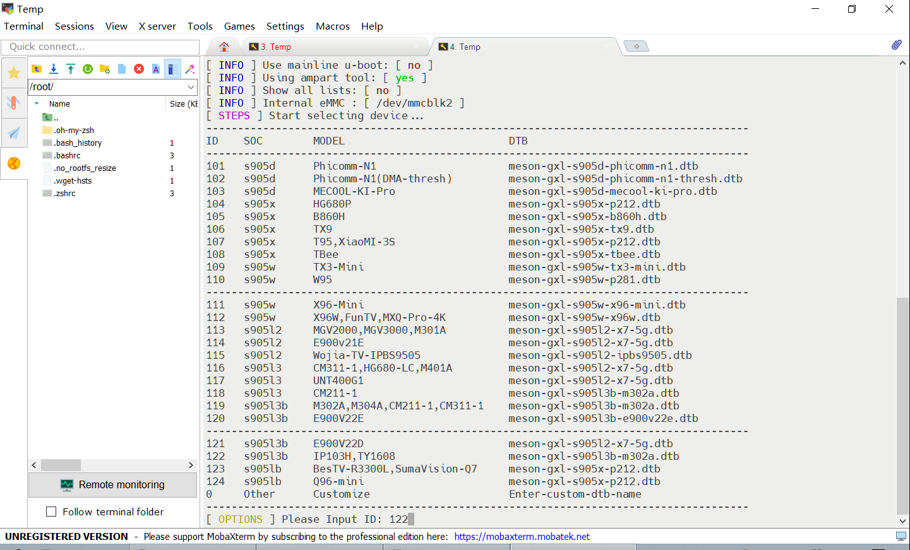
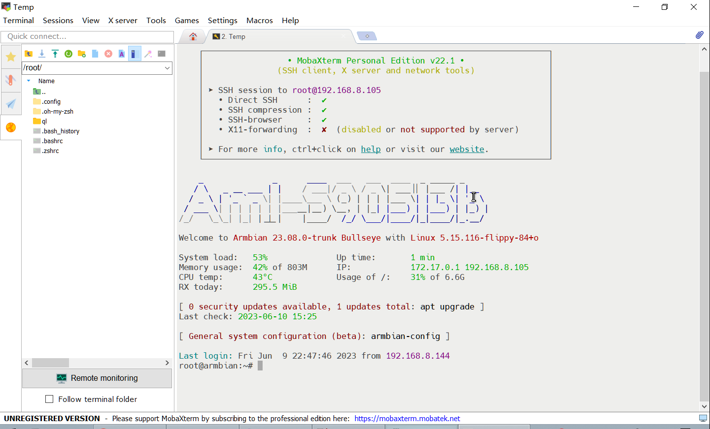

## 前言

1. 经过ophub、unifreq/flippy等大佬的默默付出，晶晨S905系列电视盒子适配armbian系统的进展越来越好。手上刚好有一台天邑的TY1608（浙江电信版），S905L3B芯片、1+8G，带2个USB2.0、1个TF卡槽，还板载了8822cs无线，如果能顺利刷成armbian盒子应该很香。
2. 实测发现坑还是比较多的，主要是HDMI、8822cs无线无法顺利工作，只能用上100M的有线网卡；另外就是ophub/amlogic-s9xxx-armbian仓库编译的stable内核的版本写入emmc无法找到IP，要使用flippy内核写入emmc才能正常运行，于是有了这个云编译仓库。

## 固件编译和下载

1. 本仓库基于armbian官方源码库<a href="https://github.com/armbian/build/">https://github.com/armbian/build/</a>进行编译，特此感谢。
2. 云编译代码修改自<a href="https://github.com/ophub/amlogic-s9xxx-armbian/">https://github.com/ophub/amlogic-s9xxx-armbian/</a>，特此感谢。
3. 不想看那么多信息的，直接下载<a href="https://pan.baidu.com/s/1tIvqGiyrn0u7QTlNm9juvg?pwd=nnkj">固件</a>。【天邑TY1608和海信IP103H用相同配置，编译出来的文档名带ip103h，实际TY1608可用；强迫症别发作啊】

## 刷机注意事项

1. 下载安卓固件（参考<a href="https://github.com/ophub/amlogic-s9xxx-armbian/issues/1332">这里</a>）
2. USB Burning Tool刷入安卓固件（还是参考<a href="https://github.com/ophub/amlogic-s9xxx-armbian/issues/1332">这里</a>）
3. 下载<a href="https://pan.baidu.com/s/1tIvqGiyrn0u7QTlNm9juvg?pwd=nnkj">armbian</a>固件
4. 用<a href="https://github.com/pbatard/rufus/releases/tag/v4.1">Rufus</a>将armbian固件写入U盘或TF卡，安卓操作U盘开机，开机时要尽快将U盘或TF卡接上接口
5. 在路由器中找到分配到的动态IP，SSH登录后运行armbian-install以写入emmc，Device ID选122、Filesystem选ext4
6. 依照屏幕提示关机、拿掉U盘或TF卡，即可从emmc开机和运行

Device ID选122：

SSH登入armbian画面：

## 固件默认信息

1. 默认IP：DHCP，因为HDMI无法工作，请在路由器查找分配的动态IP
2. 默认管理员账号：root
3. 默认管理员密码：1234

## 打赏

如果你觉得这个仓库、说明文档和固件等对你有帮助，欢迎通过微信打赏，谢谢。

